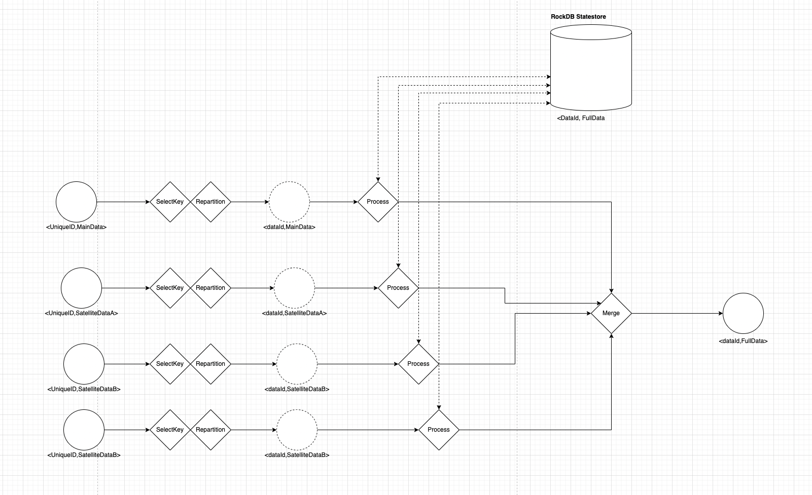

# ks-papi-reconciliation

This repository will demonstrate how to reconcile data from multiple data source using processor api of Kafka Streams.

It will also demonstrate how to do :

- Automate unit tests

## Diagram

Here is a schematic representation of the target topology :

